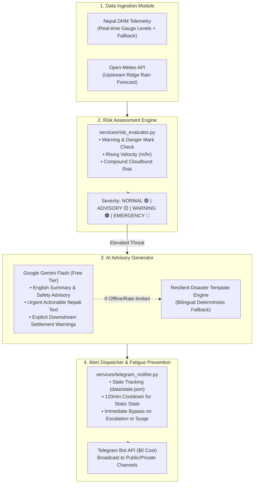

# 🌊 Nepal River Basin Flood Early Warning Bot
### 100% Free, Production-Ready Hyper-Local Flood Early Warning System in Python with Google Gemini Flash & Telegram Alerts

[]()
[-blue.svg)]()
[]()
[]()

---

## 📌 Context & Motivation

Following catastrophic flood disasters in Nepal—such as the **late September 2024 Kathmandu Valley (Balkhu, Nakkhu) and Roshi River (Panauti, Bhakunde Besi, BP Highway) tragedies**—thousands of riverside residents had little to no actionable notice before floodwaters inundated homes and washed away critical transit corridors.

Traditional monitoring systems often fail to:
1. **Detect Compound Risk:** A river gauge might still sit below danger level, but torrential upstream cloudbursts (>25 mm/hr) in steep catchments (e.g., Shivapuri hilltops or Lele ridges) guarantee a massive flood wave downstream within 30–60 minutes.
2. **Deliver Hyper-Local, Actionable Instructions:** Generic water level numbers do not convey life-saving instructions to local residents. People need urgent bilingual alerts specifically naming their settlements (e.g., *बल्खु, सुकुम्बासी बस्ती, नख्खुडोल*).
3. **Run Sustainably at Zero Cost:** Municipalities and volunteer groups often lack cloud infrastructure budgets.

This project delivers a **100% free, production-ready, zero-maintenance** early warning system running 24/7 on **GitHub Actions**, powered by **Google Gemini Flash free tier** and **Telegram Bot API**.

---

## 🏛️ System Architecture



---

## 📡 Monitored River Basins & Stations

| Station ID | River | Basin | Warning (m) | Danger (m) | Upstream Ridge | Vulnerable Downstream Settlements |
|:---|:---|:---|:---:|:---:|:---|:---|
| `bagmati_balkhu` | Bagmati | Bagmati Basin | 5.5 m | 7.0 m | Shivapuri & Sundarijal | Balkhu, Sukumbasi Basti, Sundarighat, Teku, Kalimati Corridor |
| `bagmati_gaurighat` | Bagmati | Bagmati Basin | 6.8 m | 8.0 m | Shivapuri / Gokarna | Gaurighat, Guhyeshwari, Tilganga, Sinamangal, Pashupati banks |
| `bagmati_sundarijal` | Bagmati | Bagmati Basin | 4.5 m | 5.8 m | Shivapuri National Park | Sundarijal, Naya Basti, Gokarneshwar, Jorpati riverside |
| `bagmati_chobhar` | Bagmati | Bagmati Basin | 7.0 m | 8.5 m | Kathmandu Confluence | Chobhar gorge, Nakkhu confluence, Dakshinkali road |
| `nakkhu_lele` | Nakkhu Khola | Bagmati Sub-basin | 4.0 m | 5.2 m | Lele & Southern Lalitpur | Nakkhudol, Tikabhairab, Bungamati, Saibu squatter colony |
| `roshi_panauti` | Roshi Khola | Koshi Sub-basin | 4.2 m | 5.5 m | Phulchowki & Panauti Hills | Panauti, Bhakundebesi, Roshi Rural Mun., BP Highway, Mangaltar |
| `koshi_chatara` | Saptakoshi | Koshi Basin | 6.0 m | 7.5 m | Barahakshetra / Tamor | Chatara, Barahakshetra, Prakashpur, Koshi Tappu, Sunsari-Saptari |
| `narayani_devghat` | Narayani | Narayani Basin | 7.3 m | 9.0 m | Trishuli & Kali Gandaki | Devghat, Narayangarh, Bharatpur, Gaidakot, Meghauli, Susta |

---

## 🚀 Quickstart Guide

### 1. Clone and Set Up Virtual Environment

```bash
git clone https://github.com/your-username/nepal-flood-early-warning.git
cd nepal-flood-early-warning

# Create and activate virtual environment
python3 -m venv .venv
source .venv/bin/activate

# Install free dependencies
pip install -r requirements.txt
```

### 2. Configure Free Environment Variables

Copy the template:
```bash
cp .env.example .env
```

Edit `.env` with your free credentials:

```env
TELEGRAM_BOT_TOKEN="1234567890:ABCdefGhIJKlmNoPQRstuVWXyz_EXAMPLE"
TELEGRAM_CHAT_ID="@your_flood_alerts_channel"
GEMINI_API_KEY="AIzaSyYourFreeGeminiKeyFromGoogleAIStudio"
ALERT_COOLDOWN_MINUTES="120"
```

#### 🔑 How to Get 100% Free Keys:
1. **Telegram Bot Token ($0):**
   - Open Telegram and search for [`@BotFather`](https://t.me/BotFather).
   - Send `/newbot`, choose a name (e.g., `NepalFloodAlertBot`).
   - Copy the HTTP API token into `TELEGRAM_BOT_TOKEN`.
2. **Telegram Channel ID ($0):**
   - Create a Telegram Channel (public or private).
   - Add your bot to the channel as an **Administrator** with "Post Messages" permission.
   - For public channels, set `TELEGRAM_CHAT_ID` to `@your_channel_name`.
   - For private channels, forward a channel message to [`@userinfobot`](https://t.me/userinfobot) to get the chat ID (e.g., `-1001234567890`).
3. **Google Gemini Flash API Key ($0):**
   - Visit [Google AI Studio](https://aistudio.google.com/).
   - Click **Get API key** -> **Create API key in new project**.
   - Free tier includes **15 RPM and 1,500 requests/day** (this bot consumes <100 requests/day).
   - *(Note: If no key is set or the API is rate-limited, the bot automatically falls back to its built-in disaster alert template engine without failing!)*

---

## 💻 CLI Usage

### View Real-Time River Gauges & Upstream Weather
```bash
python main.py --status
```
Outputs a clean status table:
```
===============================================================================================
🌊 NEPAL RIVER BASIN FLOOD MONITORING - REAL-TIME STATUS
===============================================================================================
Station Name                 | Level    | Warn   | Dang   | Trend     | Upstream Rain  | Risk Level
-----------------------------------------------------------------------------------------------
Bagmati at Balkhu (Kathmandu |  3.08m  |  5.50m |  7.00m | +0.06m/h  | 1.9mm/h (0.5cur) | 🟢 NORMAL
Bagmati at Gaurighat (Pashup |  4.05m  |  6.80m |  8.00m | +0.02m/h  | 3.5mm/h (2.1cur) | 🟢 NORMAL
Bagmati at Sundarijal        |  2.49m  |  4.50m |  5.80m | -0.10m/h  | 2.8mm/h (0.6cur) | 🟢 NORMAL
Bagmati at Chobhar Gorge     |  4.36m  |  7.00m |  8.50m | -0.08m/h  | 3.6mm/h (1.7cur) | 🟢 NORMAL
Nakkhu Khola at Tikabhairab  |  2.04m  |  4.00m |  5.20m | -0.06m/h  | 1.0mm/h (0.7cur) | 🟢 NORMAL
Roshi Khola at Panauti / Bha |  2.22m  |  4.20m |  5.50m | +0.05m/h  | 1.4mm/h (2.7cur) | 🟢 NORMAL
Saptakoshi at Chatara        |  4.66m  |  6.00m |  7.50m | +0.15m/h  | 1.4mm/h (0.6cur) | 🟢 NORMAL
Narayani River at Devghat    |  5.26m  |  7.30m |  9.00m | +0.07m/h  | 1.4mm/h (1.8cur) | 🟢 NORMAL
===============================================================================================
```

### Simulate Critical Flood Breach (End-to-End Verification)
```bash
# Dry run preview (prints to console)
python main.py --test-alert --dry-run

# Live Telegram test
python main.py --test-alert
```

### Run Single Cycle (for Cron / GitHub Actions)
```bash
python main.py --once
```

### Run as a Continuous Background Daemon
```bash
# Poll every 15 minutes (900 seconds)
python main.py --daemon --interval 900
```

### Target a Specific River Station
```bash
python main.py --station roshi_panauti --once
```

---

## 📲 Sample Bilingual Telegram Alert

```html
🔴 NEPAL FLOOD EARLY WARNING | बाढी पूर्वसूचना
तीव्रता तह / SEVERITY: खतराको आपतकालीन चेतावनी (Emergency) | EMERGENCY (Red)
━━━━━━━━━━━━━━━━━━━━━━
📍 नदी तथा स्टेसन: Bagmati at Balkhu (Kathmandu)
🌊 नदी प्रणाली: Bagmati (Bagmati River Basin)
📏 वर्तमान जलसतह (Level): 8.07 m
⚠️ सतर्कता तह (Warning): 5.50 m | 🔴 खतरा तह (Danger): 7.00 m
📈 जलसतहको गति (Trend): +0.56 m/hr (RISING)
⛈️ माथिल्लो तटीय वर्षा (Shivapuri & Sundarijal Hilltops): हाल: 33.5 mm | १ घण्टा: 32.9 mm

⚡ चेतावनी: दोहोरो जोखिम (Compound Flood Threat)! उच्च जलसतह + माथिल्लो तटीय भीषण वर्षा।

🇳🇵 नेपाली सतर्कता सन्देश (Actionable Advisory):
🚨 आपतकालीन बाढी चेतावनी (CRITICAL EMERGENCY)!
• स्थान: Bagmati at Balkhu (Kathmandu) (Bagmati नदी)
• वर्तमान जलसतह: 8.07 मिटर (खतराको सीमा: 7.00 मिटर)
• जलसतहको गति: +0.56 m/hr को तीव्र गतिमा बढ्दो
• माथिल्लो तटीय वर्षा: Shivapuri & Sundarijal Hilltops क्षेत्रमा 32.9 मि.मि./घण्टा वर्षाको पूर्वानुमान
⚠️ तत्काल निर्देशन: बल्खु, सुकुम्बासी बस्ती, सुन्दरीघाट, टेकु, चोभार, कालिमाटी करिडोर, नदी किनारका होचा भूभागहरू का बासिन्दाहरू तुरुन्त सुरक्षित, अग्लो स्थान तथा नजिकैको सामुदायिक आश्रयस्थलतर्फ जानुहोस्। अत्यावश्यक कागजात, औषधि र टर्चलाइट साथमा लिनुहोस्। बाढी पसेका सडक वा पुल तर्ने प्रयास नगर्नुहोला।

🇬🇧 ENGLISH SUMMARY:
🚨 CRITICAL FLOOD EMERGENCY at Bagmati at Balkhu (Kathmandu)!
• River Level: 8.07m (DANGER MARK: 7.00m, Breach: +1.07m)
• Trend: Rapidly rising at +0.56 m/hr
• Upstream Rain: 32.9 mm/hr forecasted in Shivapuri & Sundarijal Hilltops
• Immediate Action: Downstream communities in Balkhu, informal squatter settlements (Sukumbasi basti), Sundarighat, Teku, Kalimati corridor, low-lying riverside communities must EVACUATE IMMEDIATELY to designated higher ground or municipal flood shelters. Do not attempt to cross bridges or low-lying paths.

🚨 उच्च जोखिमयुक्त तटीय क्षेत्रहरू (Vulnerable Downstream Areas):
• बल्खु, सुकुम्बासी बस्ती, सुन्दरीघाट, टेकु, चोभार, कालिमाटी करिडोर, नदी किनारका होचा भूभागहरू

━━━━━━━━━━━━━━━━━━━━━━
📡 स्रोत: DHM Telemetry & Open-Meteo | AI: Google Gemini Flash
🕒 अपडेट समय: 2026-09-04 04:50:00 UTC
🆘 आपतकालीन नम्बरहरू: नेपाल प्रहरी १०० | सशस्त्र प्रहरी बल १११४
```

---

## 🛡️ Alert Fatigue Prevention & Cooldown Rules

Repeatedly buzzing subscriber phones when water levels remain static leads to muted channels and ignored warnings. The bot enforces strict state-tracking logic in [`services/telegram_notifier.py`](file:///Users/success/googleweatherbot/services/telegram_notifier.py):

1. **Normal Flow (Green):** Zero alerts dispatched.
2. **Threat Escalation:** If severity escalates (e.g., `ADVISORY` ➔ `WARNING`, or `WARNING` ➔ `EMERGENCY`), an alert is dispatched **immediately**, bypassing any active cooldown.
3. **Same Severity Cooldown:** If a station remains in `WARNING` or `EMERGENCY`, notifications are throttled to once every **120 minutes** (configurable via `ALERT_COOLDOWN_MINUTES`).
4. **Sudden Surge Bypass:** If water level surges by **$\ge 0.40\text{ m}$** since the last bulletin, the bot alerts immediately even during an active cooldown.
5. **"All Clear" Recovery Bulletin:** When a river that was in `WARNING` or `EMERGENCY` recedes back safely to `NORMAL`, the bot dispatches a reassuring recovery bulletin (*खतराको स्तर घट्दो - सुरक्षित*).

---

## ⚙️ 100% Free Automation via GitHub Actions

The repository includes a ready-to-use GitHub Actions workflow [`.github/workflows/flood_monitor.yml`](file:///Users/success/googleweatherbot/.github/workflows/flood_monitor.yml) that polls telemetry **every 15 minutes**:

1. Push your repository to GitHub:
   ```bash
   git init
   git add .
   git commit -m "feat: Nepal River Basin Flood Early Warning Bot"
   git branch -M main
   git remote add origin https://github.com/<your-username>/<your-repo>.git
   git push -u origin main
   ```
2. Navigate to your repository on GitHub:
   - Go to **Settings** > **Secrets and variables** > **Actions**.
   - Under **Repository secrets**, add:
     - `TELEGRAM_BOT_TOKEN`
     - `TELEGRAM_CHAT_ID`
     - `GEMINI_API_KEY`
3. Enable GitHub Actions in the **Actions** tab. The cron schedule `*/15 * * * *` will automatically run single polling cycles 24 hours a day, 7 days a week at **$0 cost**.
4. The workflow utilizes `actions/cache` to persist `data/state.json` across runner instances, ensuring alert cooldowns remain active between CI runs!

---

## 🧪 Testing & Verification

Run the full pytest suite:
```bash
pytest tests/ -v
```

Output:
```
============================== 28 passed in 0.27s ==============================
```

The test suite covers:
- DHM telemetry ingestion & mock data modeling
- Open-Meteo precipitation thresholds (>25 mm/hr cloudburst detection)
- Compound risk evaluation & severity progression
- Gemini Flash bilingual advisory generation & deterministic template fallbacks
- Telegram HTML escaping, alert fatigue suppression, surge bypass, and de-escalation
- CLI entry points and arguments (`--status`, `--test-alert`, `--once`, `--mock`, `--dry-run`)

---

## 🤝 Contributing & Community Defense

In a changing climate with increasing cloudburst intensity across Nepal's mountainous topography, open early-warning tools save lives.

Pull requests are warmly welcomed:
- Add additional DHM gauge stations (e.g., West Rapti, Babai, Karnali, Kankai, Kamala).
- Add SMS / IVR integration hooks.
- Enhance local municipal shelter mapping.

---

## 📜 License

MIT License — free for humanitarian, municipal, and community disaster risk reduction use.
